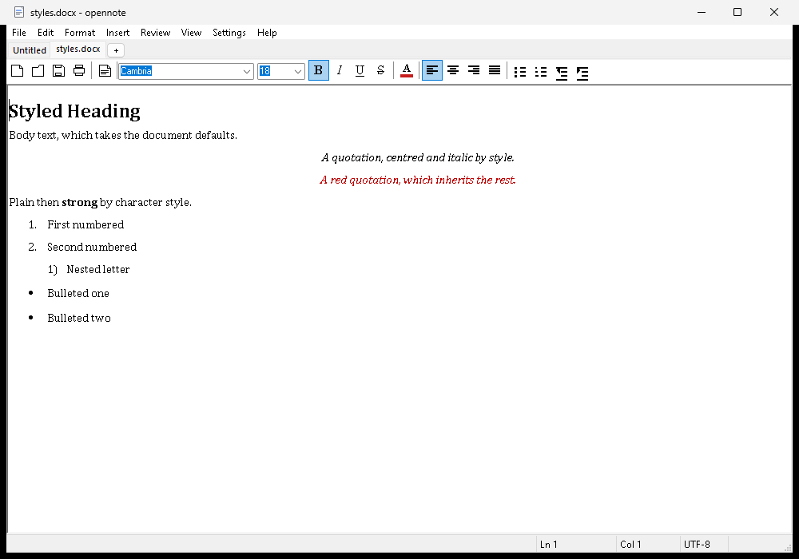
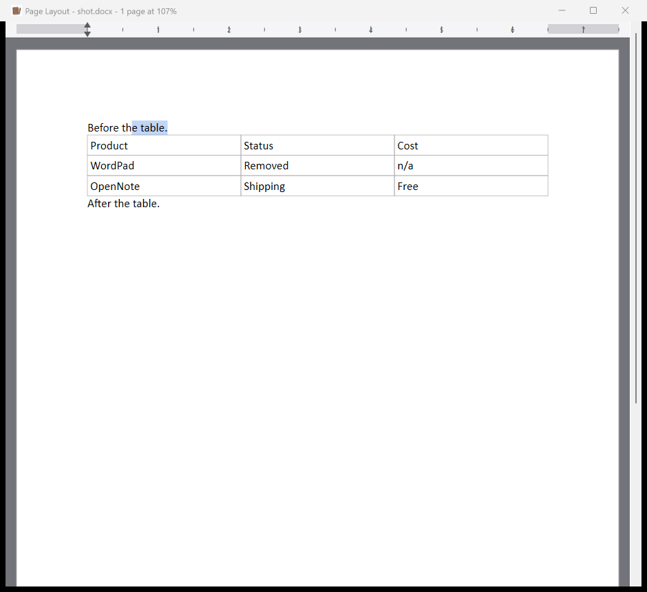
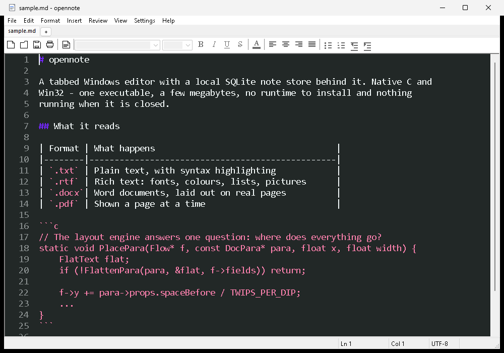
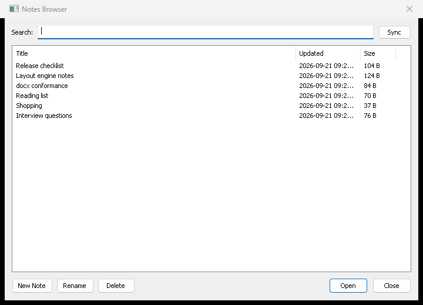
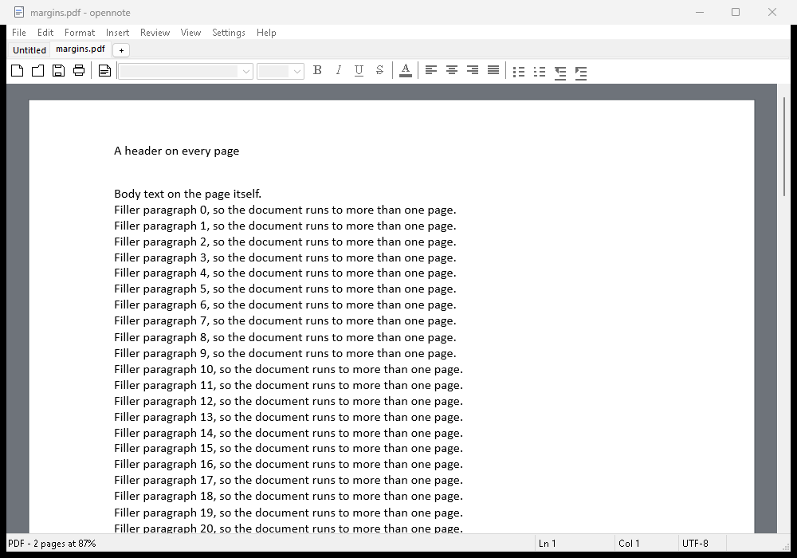

# opennote

```
                                    _
  ___  _ __   ___ _ __  _ __   ___ | |_ ___
 / _ \| '_ \ / _ \ '_ \| '_ \ / _ \| __/ _ \
| (_) | |_) |  __/ | | | | | | (_) | ||  __/
 \___/| .__/ \___|_| |_|_| |_|\___/ \__\___|
      |_|
```

[](https://github.com/sp00nznet/opennote/actions/workflows/ci.yml)
[](https://github.com/sp00nznet/opennote)
[](LICENSE)
[](https://en.wikipedia.org/wiki/C_(programming_language))

A tabbed Windows editor with a local SQLite note store behind it. Native C and Win32 —
one executable, a few megabytes, no runtime to install and nothing running when it is
closed.

Sibling project to [futureburn](https://github.com/sp00nznet/futureburn),
[pstfree](https://github.com/sp00nznet/pstfree),
[vncfree](https://github.com/sp00nznet/vncfree) and
[bulkhead](https://github.com/sp00nznet/bulkhead) — same attitude: find the Windows
payware, read the published spec it is hiding behind, give it away.

## Status

**v0.10.0 — alpha. Tracked changes, comments, fields and a table of contents: the part of a Word document a company cannot do without.** Downloads are on the
[releases page](https://github.com/sp00nznet/opennote/releases/latest): a bare executable
and an installer, with the release notes saying what each one does and does not give you.

Three security issues are known and documented in [SECURITY.md](SECURITY.md). A build
made from source without the optional OAuth variables is not affected by any of them.

### Word documents

As of v0.6.0 OpenNote opens and saves **`.docx`** — ECMA-376 WordprocessingML.
Formatting, alignment, lists, indents, tables, tracked-deletion handling and Unicode all
come through. There is no new dependency: a `.docx` is an Open Packaging Conventions
container, and Windows ships the API for exactly that shape (`IOpcFactory`) alongside a
pull XML reader (`IXmlReader`). The container and the parser were never this project's
code to own.

**Conformance:** `230/230 checks across 12 documents`, and fidelity is measured rather than claimed — see
[Conformance](#conformance) below.

As of v0.7 a document is a real tree (sections, paragraphs, runs, tables, cells) rather
than whatever the editor control happens to be holding, and every format is a serializer
over it. **Tables now survive being saved back to `.docx`**, which they did not before.

### The WordPad replacement

**Windows shipped a rich text editor for thirty years and removed it.** WordPad is gone
from Windows 11 24H2 and Windows Server 2025. Microsoft's suggested replacement is a
subscription: Microsoft 365 is $70–100/yr, or $150 once for Office 2024.

As of v0.5.0 OpenNote opens, edits and saves `.rtf` — fonts, sizes, colours, bold, italic,
underline, strikethrough, super/subscript, alignment, line spacing, bullets, numbering,
indent, pictures — with a formatting toolbar, spell check, page setup and multi-page
printing. The whole application is a **3.6MB executable** with no runtime to install.



It is built on Windows' own RichEdit control, which is how WordPad itself worked. That
has a known ceiling: tables are weak and the view flows rather than showing page
boundaries. The layout engine lifts both — see [ROADMAP.md](ROADMAP.md).

### Page layout

As of v0.8 a document is laid out onto pages rather than flowed into a window:
paragraphs measured and broken at a line when they do not fit, widows and orphans kept
off the page, tables boxed with the column widths the file states, pages sized by Page
Setup. `IDWriteTextLayout` does the shaping, line breaking and font fallback; what
OpenNote adds is the part above it, and it knows nothing about windows — the same
geometry draws the page view, the printout and the PDF, so they cannot disagree.

As of v0.9 the engine lays out what documents actually contain: named styles resolved
through `basedOn` to the document defaults, real numbered lists that count (including
letters and roman numerals, and `1.2.` for a nested level), pictures, columns, page
breaks, headers and footers on every page, and footnotes at the foot of the page their
reference landed on.

**The page view is a view of the tab**, not a window of its own: View > Page Layout, the
toolbar's page button, or Ctrl+Shift+L switches the document you are in between flowing
text and laid-out pages, and every tab remembers which it is showing. **It edits there**. A click names a
character, the arrows walk the laid-out lines rather than the runs behind them, Home and
End mean the wrapped line, Page Up and Page Down mean an actual page, and there is a
ruler with draggable indent markers. Undo is a stack of model snapshots. Character
formatting still belongs to the rich text view, and the page view writes its changes
back to the document when it closes.



### Review, and the parts a document works out for itself

As of v0.10 a document carries what a working document carries. **Tracked changes** are
state rather than something dropped on the way in: a deletion is kept, invisible until
you reject it, and written back where it came from — Review → Accept All Changes and
Reject All Changes resolve them. **Comments** live in their own part with markers in the
text; Review → New Comment adds one to the paragraph you are in.

**Fields** are answered when the document is laid out, because that is the only moment
the answer is known: `PAGE`, `NUMPAGES`, `DATE`, `TIME`, `REF` and `PAGEREF`. On top of
them, **Insert → Page Numbers** puts "Page N of M" in the footer and **Insert → Table of
Contents** builds one from the headings, each entry pointing at a bookmark on its
heading — so the numbers follow the document instead of describing where it used to be.

**Export to PDF** goes through Windows' own PDF printer, so there is no PDF library in
here; the output is vector and the text in it is still text.

**And, as of v0.11, a PDF opens.** It gets a tab of its own and shows its pages — Windows
has shipped the renderer since 8.1, so there is still no PDF library in here. **And a PDF form can be filled in** — the reason this matters: the form you have to fill
in and send back arrives as a PDF, and the free tools for it are adware or a web upload.
File → Fill PDF Form lists the fields, takes what you type and writes a filled copy, as an
incremental update: the original bytes stay, the answers are appended. Nothing here parses
a PDF except the part that does that — which now includes the compressed cross-reference
streams and object streams every writer has produced since 2005, on top of an inflate
written for the purpose: three hundred lines, no new dependency.

Stamping a signature on one is next.

The stretch is the part Word actually gets paid for: `.docx`, real page layout, `.doc`,
track changes. Everything needed for that is already in Windows and already paid for.
DirectWrite does the text shaping, `ISpellChecker` does spelling, Microsoft Print to PDF
does the export, and [MS-DOC], [MS-CFB] and ECMA-376 are all published specifications
anyone can download.

[LibreOffice](https://www.libreoffice.org) Writer is genuinely free, genuinely good, and
further along than this will be for a long time. Use it today. OpenNote exists because a
350MB office suite is not what most people wanted when they opened WordPad — and because
nothing free reads a legacy `.doc` well, now that the last in-box reader has left with it.

Likewise on the editor side: **VS Code and Notepad++ are free and excellent**, and this
does not compete with them. Syntax highlighting is here because Scintilla provides it, not
because anyone should switch.

See [ROADMAP.md](ROADMAP.md) for the ordering.

---

## Screenshots

| The editor | The notes browser |
|------------|-------------------|
|  |  |

**A PDF, opened.** Windows renders the pages; opennote shows them, a tab like any other.



---

## Build and run

From a clean machine:

1. Install **Visual Studio 2022** with the *Desktop development with C++* workload, and
   **CMake 3.16+** (the Visual Studio installer can provide both). Windows 10 or 11.

2. Clone and build:

   ```powershell
   git clone https://github.com/sp00nznet/opennote.git
   cd opennote
   cmake -B build -A x64
   cmake --build build --config Release
   ```

   SQLite and Scintilla are vendored in `lib/`. There is nothing else to fetch.

3. Run it:

   ```powershell
   .\build\bin\OpenNote.exe
   .\build\bin\OpenNote.exe --selftest   # check the crypto and RTF paths
   ```

   An empty tab opens. Your notes database is created at
   `%APPDATA%\OpenNote\opennote.db` the first time you save a note.

---

## Usage

```powershell
OpenNote.exe                 # empty tab
OpenNote.exe notes.txt       # open a file in a tab
OpenNote.exe report.rtf      # open a rich text document
OpenNote.exe report.docx     # open a Word document
OpenNote.exe --selftest      # run the built-in checks and exit
```

### What it does

| | |
|---|---|
| **Word documents** | `.docx` read and write — ECMA-376, via Windows' own packaging API |
| **Rich text** | `.rtf` documents: fonts, colours, alignment, lists, indent, pictures, printing |
| **Tabs** | Several documents at once, with the session restored on next launch |
| **Syntax highlighting** | Via Scintilla — 100+ languages |
| **Note store** | SQLite with FTS5 full-text search, browsable, import and export |
| **Compare** | Side-by-side diff between any two open documents |
| **Cross-tab search** | Find and replace across every open tab |
| **Shell integration** | Run selected text through CMD or PowerShell |
| **Cloud sync** | Optional, to your own GitHub or Google Drive. See the caveats below |

### Keyboard

| | | | |
|---|---|---|---|
| `Ctrl+N` | New file | `Ctrl+F` | Find |
| `Ctrl+O` | Open file | `Ctrl+H` | Replace |
| `Ctrl+S` | Save | `Ctrl+G` | Go to line |
| `Ctrl+W` | Close tab | `F3` | Find next |
| `Ctrl+Tab` | Next tab | `Ctrl++` | Zoom in |
| `Ctrl+Shift+Tab` | Previous tab | `Ctrl+-` | Zoom out |
| `Ctrl+B` | Bold | `Ctrl+I` | Italic |
| `Ctrl+U` | Underline | `Ctrl+P` | Print |
| `Ctrl+Shift+L` | Page layout view | `Esc` | Close it, keeping the edits |

Every key, button and mouse gesture, including the page layout view's own, is in
[docs/controls.md](docs/controls.md).

### Cloud sync

Off unless you connect an account, and it talks to GitHub or Google directly — there is
no server in between and this project does not operate one.

**No API key ships with OpenNote** — not a client secret, and not a client ID. The
published binaries contain neither, CI passes no credentials, and the build fails outright
if a client secret is offered to it, so a released build can be reproduced byte for byte
from its tag. GitHub uses the device flow and Google uses PKCE against an OAuth
application you register yourself, which stays yours: your quota, your consent screen,
your revocation. Tokens and the Google client secret are wrapped with DPAPI before they
reach the database. See [SECURITY.md](SECURITY.md) and
[docs/cloud-sync-setup.md](docs/cloud-sync-setup.md).

Credentials go in under **Settings → Default Settings… → Sync Accounts… → Credentials…**,
so an installed copy can be given them without a rebuild. It is still the least finished
part of the codebase — the sync itself is last-writer-wins, and the vault work that fixes
that is v0.3.

### Configuration

Everything lives in `%APPDATA%\OpenNote\opennote.db` — settings, notes and session. There
is no config file to edit and no registry key to find. Deleting that one file resets the
application completely.

---

## Documentation

| | |
|---|---|
| [Getting started](docs/getting-started.md) | Installing, the first document, pages, printing, notes, sync — the twenty minutes after the download |
| [Controls](docs/controls.md) | Every key, toolbar button and mouse gesture, in both views |
| [Overview](docs/overview.md) | What this is: where it came from, what is WordPad about it, what is Word about it, and the goals |
| [Cloud sync setup](docs/cloud-sync-setup.md) | Registering your own OAuth application with GitHub and Google |
| [Building the installer](docs/building-installer.md) | Packaging a release |
| [ROADMAP.md](ROADMAP.md) | The ordering, version by version |
| [SECURITY.md](SECURITY.md) | Known issues, stated rather than buried |

---

## Building from source

Covered under [Build and run](#build-and-run) above; that is the only way to run it
right now. `cmake -B build && cmake --build build --config Release` is the whole thing.

Do not pass the OAuth CMake variables for a normal build — see
[CONTRIBUTING.md](CONTRIBUTING.md).

---

## Conformance

`.docx` handling is checked against a corpus on every build. The count is reported rather
than a bare "tests passed", and **fidelity is a number, not a claim**:

```
> OpenNote.exe --docx-check build/corpus
docx conformance: 230/230 checks across 12 documents
model fidelity:   84327/84327 properties survive .docx -> model -> .docx
editor fidelity:  84189/84191 properties survive a load, edit and save
```

Fidelity counts what the *source document stated* and the round trip failed to preserve.
A document that never named a font and comes back saying Calibri has lost nothing — the
reader resolved a default — so that is not counted. A font it did name and lost, is.

The two numbers are kept apart because conflating them hides which half broke: the first
is the serializer with no editor involved, the second is a real load-edit-save through
the control.

**What the editor path still loses, all named by the harness on every run.** Every one of
them is something the RichEdit control has no way to hold; nothing is lost going through
the model, which is why the two numbers are kept apart.

| Loss | Why |
|---|---|
| A paragraph's style, and its heading *level* | The control has no notion of named styles, so `Heading 1` comes back as bold 18pt body text. The appearance survives; the name does not |
| A table's column widths | The control does not give them back, so the reader auto-sizes |
| A lettered or roman list, which comes back numbered | Its RTF reader takes `\pndec` and nothing else. Given `\pnlcltr` it drops the numbering and leaves the marker behind as text, which is worse |
| A page-break *run* in the middle of a paragraph | `\page` reaches the control and does not come back out |

Pictures, headers, footers, footnotes, the page setup and the numbering behind a list are
all things the control cannot hold either — those survive because a document opened from
a file keeps its model beside the view, and what the view cannot say is taken from there.

The corpus is **generated, not committed**, so the repository carries no binary Office
documents:

```powershell
python tests/make_fixtures.py build/corpus     # build the corpus
.\build\bin\OpenNote.exe --docx-check build/corpus
python tests/validate_docx.py build/corpus/out # check what the writer produced
```

`Doc_Compare` is itself covered by `--selftest`: it deliberately breaks a model and
requires each change to be noticed. A comparison that never reported anything would make
every fidelity number above a lie.

Each document has a `.expect` file listing what the converted RTF must and must not
contain — that a tracked deletion is absent, that a heading keeps its weight, that cell
edges come from `w:tblGrid`, that non-ASCII survives as `\uN`. Every document is also
written back out as `.docx` and re-read, asserting no text is lost, and
`tests/validate_docx.py` then checks those packages with Python rather than with
OpenNote's own reader.

`--docx2rtf <file.docx>` prints the converted RTF, which is the thing to look at when a
document comes out wrong. `--layout-report <file.docx>` prints where the layout engine
put everything — page size, page count, and per page how much it placed and how far down
the page it reached — and `--export-pdf <file.docx> <out.pdf>` writes the PDF without a
window.

---

## Project structure

```
src/ui/      Window, tabs, editors (plain + rich), page view, toolbar, dialogs
src/core/    Document model, serializers (.docx, RTF), file I/O, search
src/layout/  The layout engine: document model -> pages, and printing them
src/db/      SQLite, notes and links repositories
src/sync/    OAuth, GitHub and Google Drive sync
res/         Icons, dialogs, manifest
lib/         Vendored SQLite and Scintilla
```

See [ARCHITECTURE.md](ARCHITECTURE.md).

---

## Contributing

Issues and pull requests welcome — [CONTRIBUTING.md](CONTRIBUTING.md). It also carries the
rule that matters most for the format work ahead: nothing derived from a proprietary
binary is ever committed.

## License

MIT — see [LICENSE](LICENSE).
